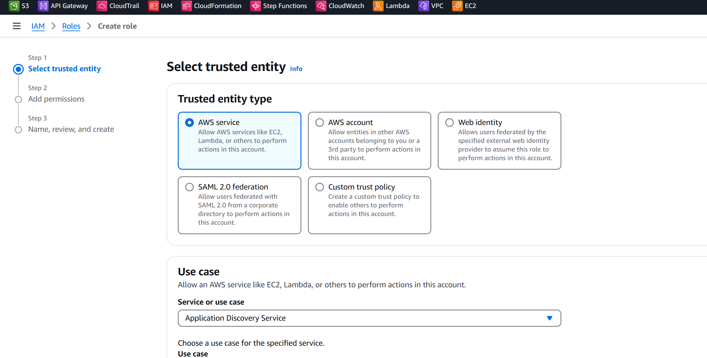
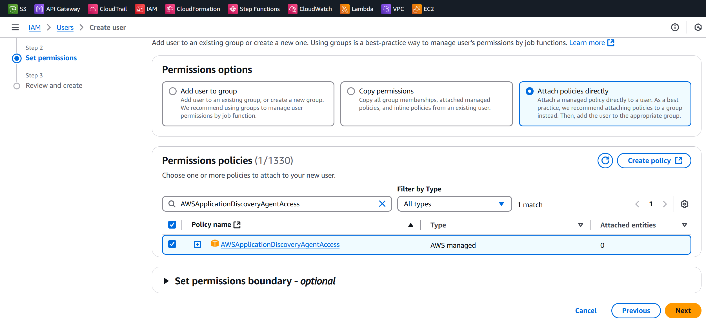
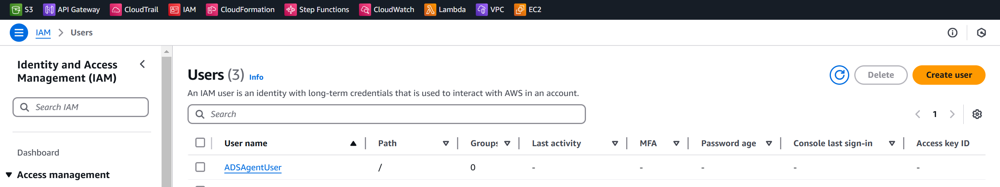
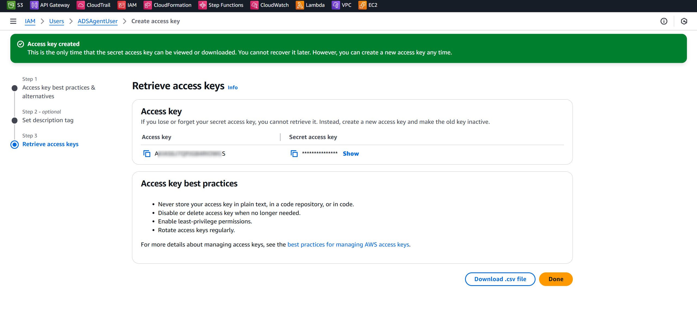

# 🚀 Steps to Create a Role for AWS Application Discovery Service (ADS)

This guide provides step-by-step instructions to create an IAM role for **AWS Application Discovery Service (ADS)**, which is used for securely collecting data from your source systems during migration.

---

## **Step 1: Open the AWS IAM Console**
1. Navigate to the [IAM Console](https://console.aws.amazon.com/iam/).
2. In the left-hand navigation pane, click **Roles**.
3. Click on the **Create Role** button.

---

## **Step 2: Select Trusted Entity**
1. Under **Trusted Entity**, select **AWS Service**.
2. In the **Use Case** section, search for and choose **Application Discovery Service**.
3. Click **Next** to continue.

---

## **Step 3: Attach Policies**
1. AWS will suggest the appropriate policies for ADS. Ensure the following policy is selected:
   - **AWSApplicationDiscoveryAgentAccess**: Grants the ADS agent permission to communicate with AWS.
2. Optional:
   - Attach **AWSApplicationDiscoveryServiceFullAccess** if you require full management of ADS and its resources.
3. Click **Next**.

---

## **Step 4: Configure Role Details**
1. Provide a **Role Name**:
   - Example: `ADS-Agent-Access-Role`
2. Add a **Description** (optional):
   - Example: "This role allows AWS Application Discovery Service (ADS) agents to collect and send migration data to AWS."
3. Click **Create Role**.

---

## **Step 5: Review and Save**
1. After creating the role, you will be redirected to the role's details page.
2. Note the **Role ARN** (Amazon Resource Name). You will need this for configuring ADS agents.

---

## **Optional: Use Access Keys for ADS Agent Setup**
If you plan to use programmatic access keys instead of roles, follow these steps:
1. Create a new **IAM User**:
   - Go to **Users** > **Add User**.
   - Enable **Programmatic Access**.
2. Attach the **AWSApplicationDiscoveryAgentAccess** policy.
3. Generate and download the **Access Key ID** and **Secret Access Key**.
   - These will be used during the configuration of the ADS agent on source systems.

---

## **Security Best Practices**
1. **Use Least Privilege**:
   - Only attach the policies required for ADS functionality.
2. **Rotate Access Keys**:
   - Regularly rotate any programmatic access keys used.
3. **Monitor Activity**:
   - Use AWS CloudTrail to log actions performed by this role.
4. **Grant Temporary Access**:
   - Prefer roles over long-term access keys to minimize security risks.

---

## **Next Steps**
- Deploy and configure ADS agents on your source systems (e.g., on-premise servers or VMs).
- Verify data collection in **AWS Migration Hub**.

For additional details, refer to the [AWS Application Discovery Service Documentation](https://docs.aws.amazon.com/application-discovery/latest/userguide/).

