### Prepare infrastructure for Target Web application and database migration

## Setup Network

- Run cloudformation template: obbs-target-infra.yml

## Create a TargetOBBSVPC

## Create DMS Replication Security Group: DMS-RI-SG 

- Inbound Rules:

- Outbound Rules:
    (Keep default: All Traffic, 0.0.0.0/0)

## Create Target RDS DB Security Group: RDS-DB-SG

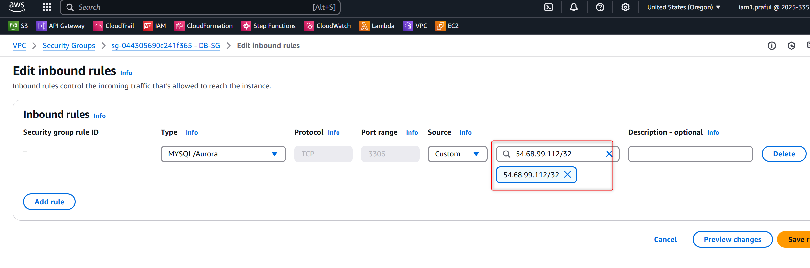

- Add Inbound rules from DMS-RI-SG , Add: Custom TCP, 3306, Custom: DMS-RI-SG)
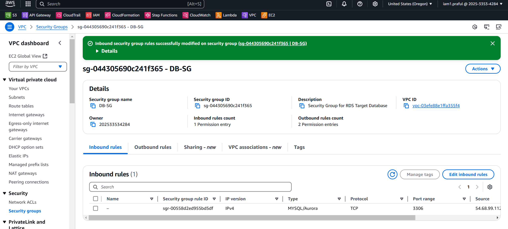

- Inbound Rules:
    Custom TCP, 3306, Custom: DMS-RI-SG

- Outbound Rules:
    (Keep default: All Traffic, 0.0.0.0/0)

## Ceate a Target RDS(MySQL) Database

- Create a DB Subnet Group in Private Subnets
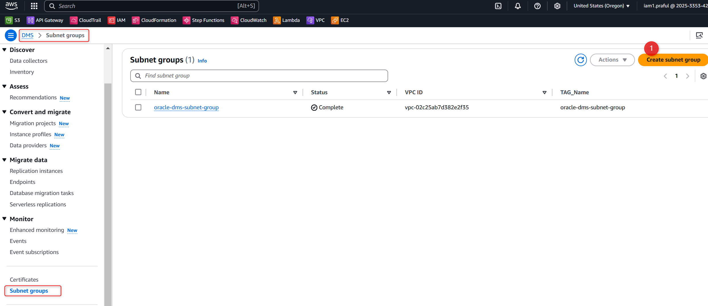

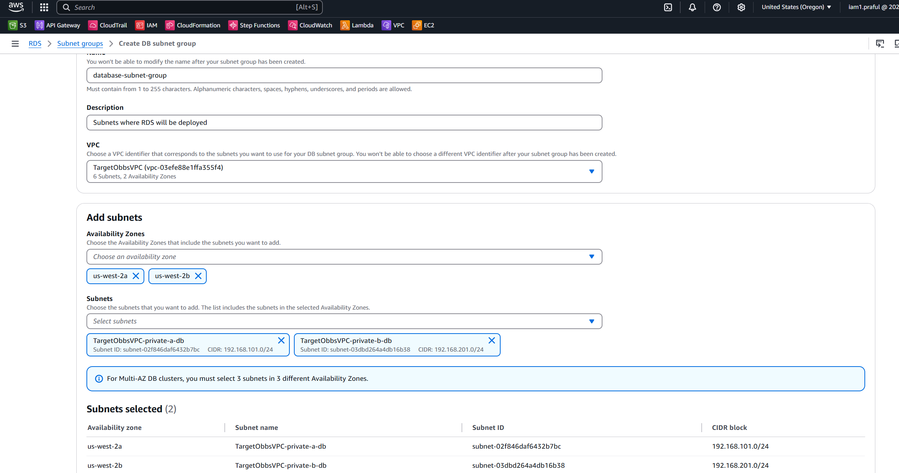 

- Select MySQL
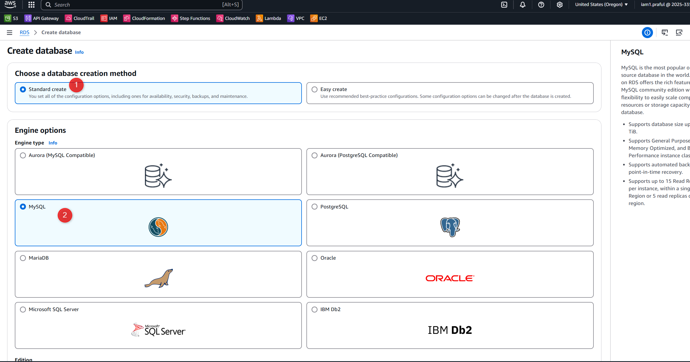 

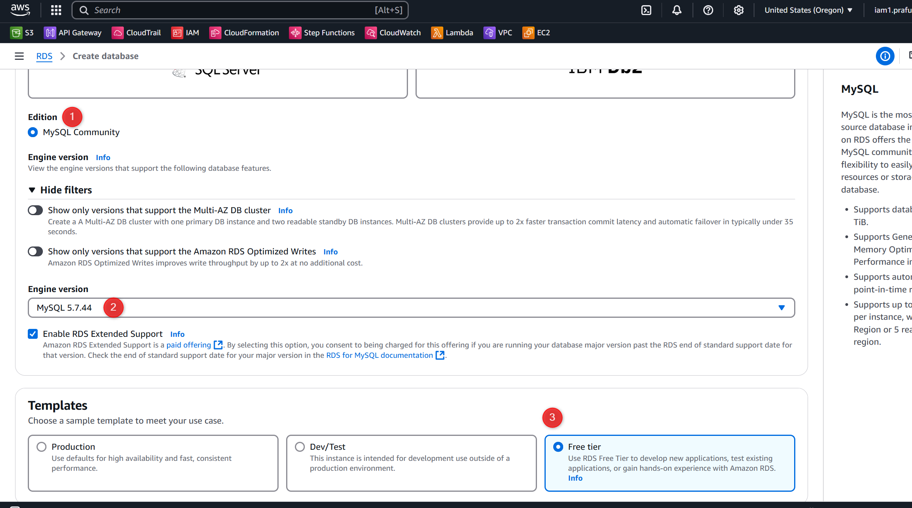 

- Provide Database Credentials 
    user: admin
    Pasw: admin1234
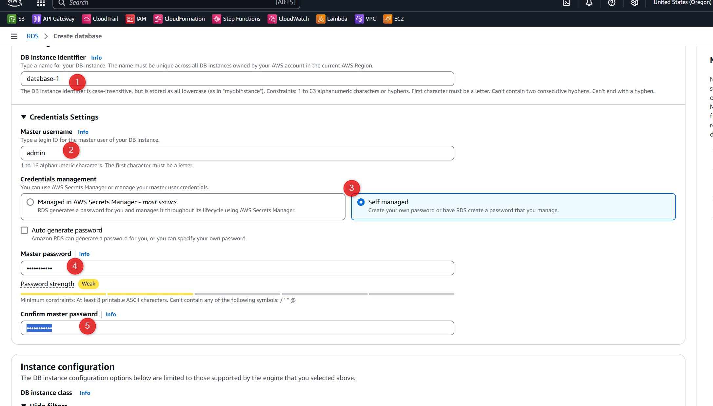 

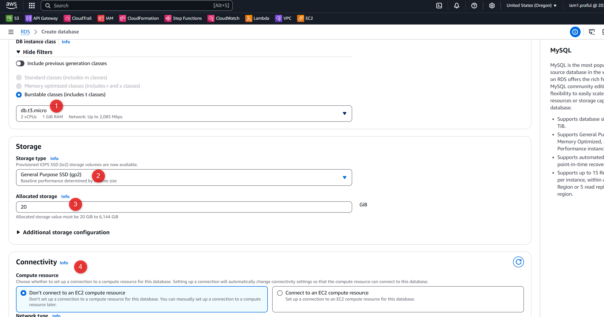 

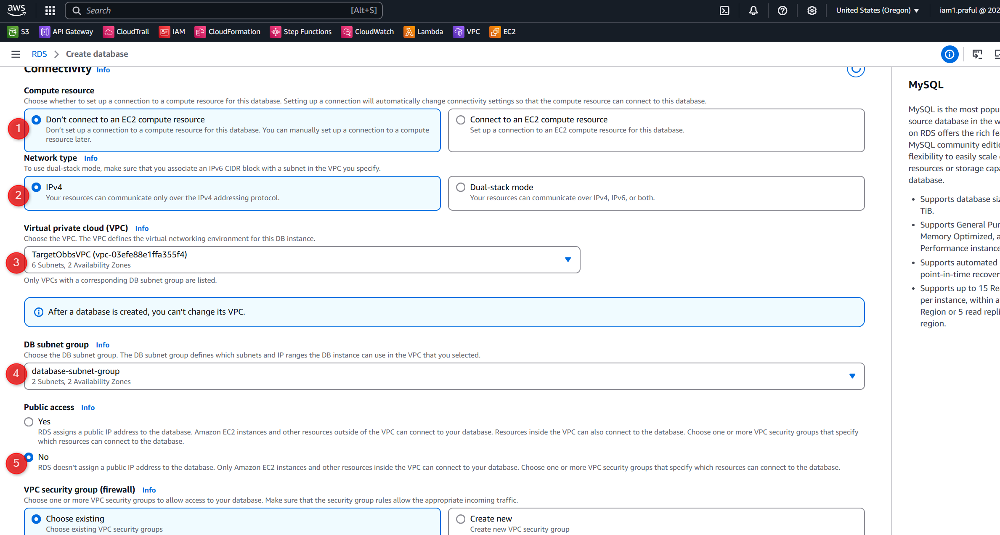 

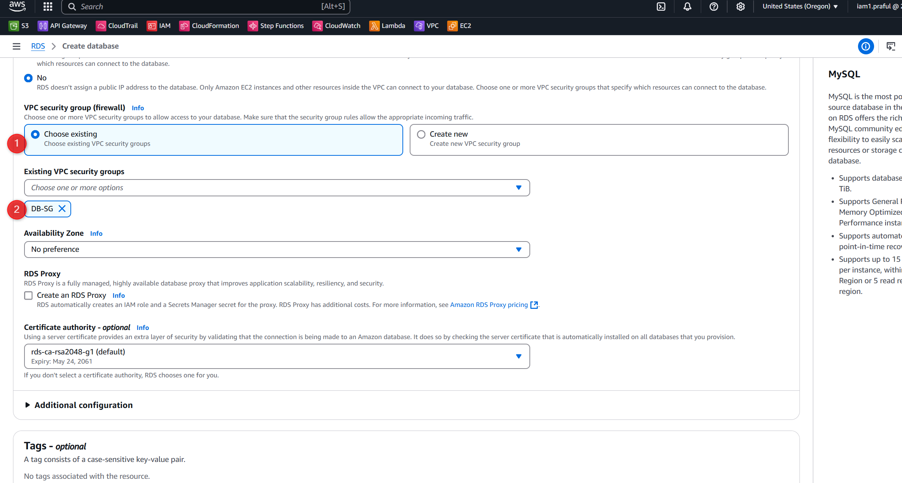 

- RDS MysQL Database created

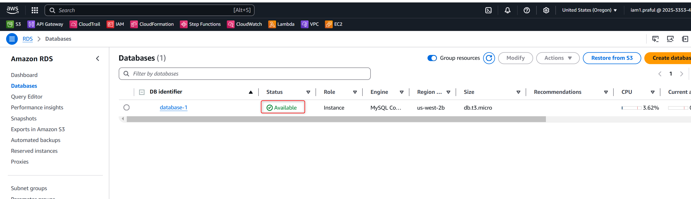

## Create DMS Replication Instance

### Create DMS Replication Instance subnet Group

- Select Public Subnet groups for DMS Replication instance
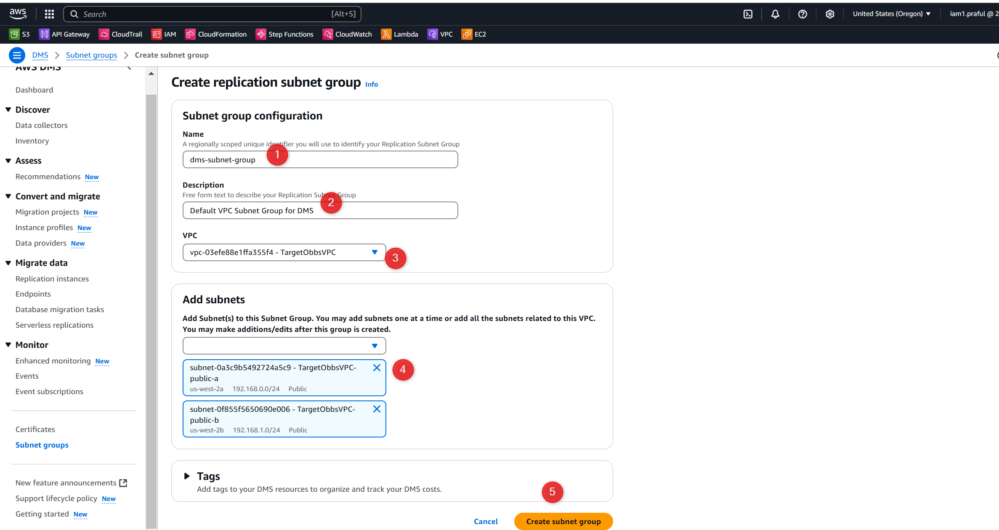

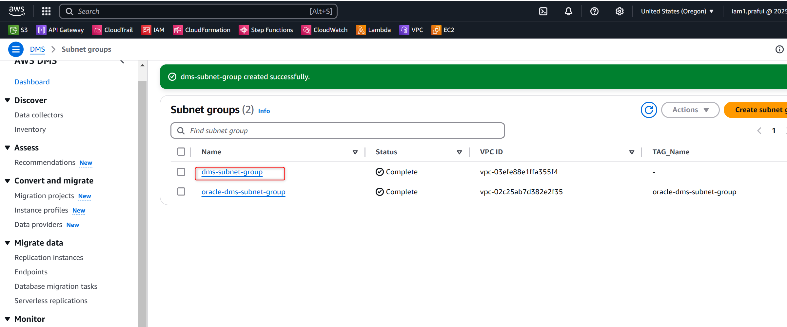 

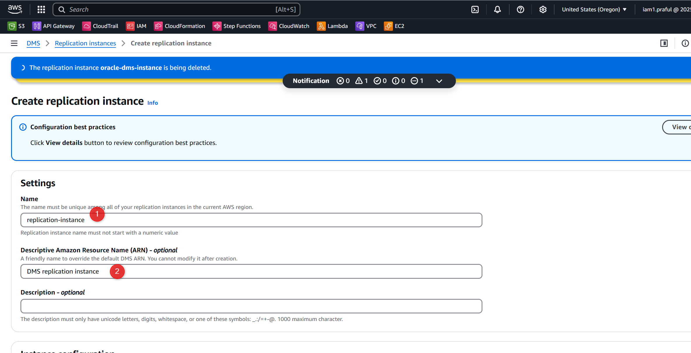 

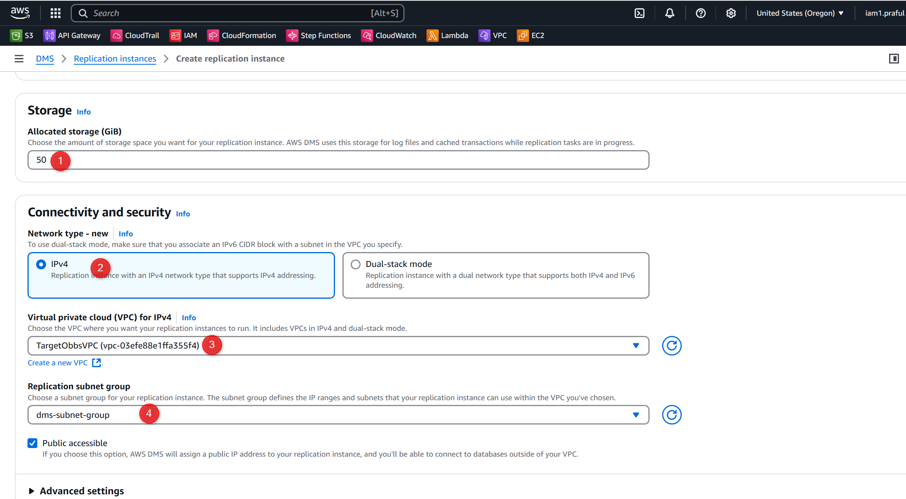 

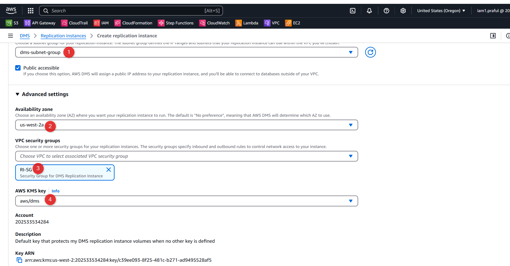 

- Need to add AWS DMS Role

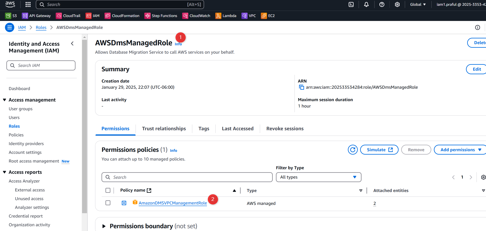

- DMS instance created 
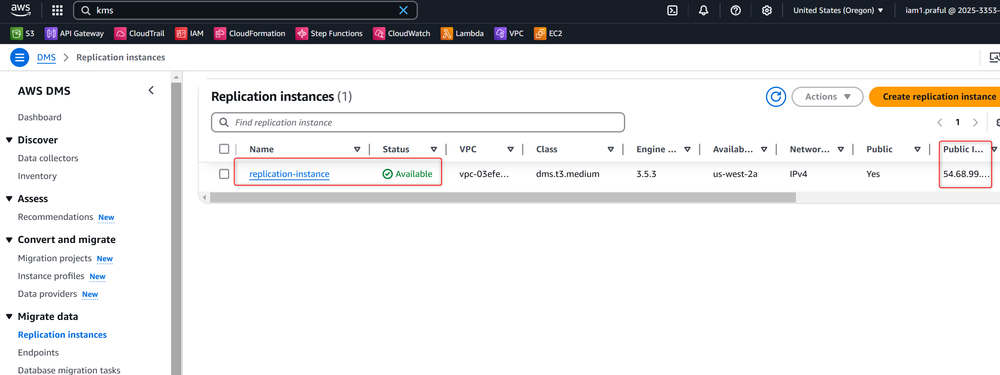

- Copy the Private IP of DMS instance and add inbound Rule in RDS-DB-SG 

  Inbound Rule
  MySQL/Aurora | TCP 3306 | Cusotm | {Replication instance Private IP }

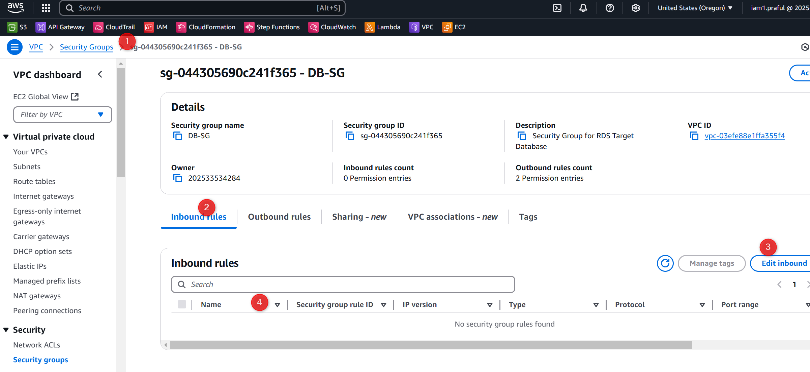

