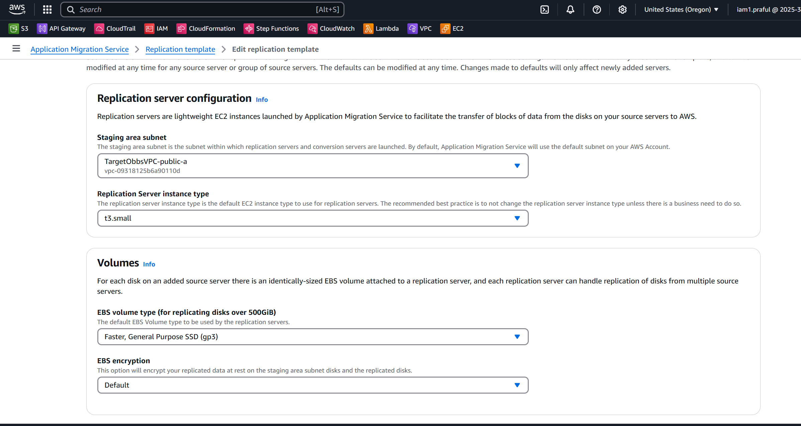
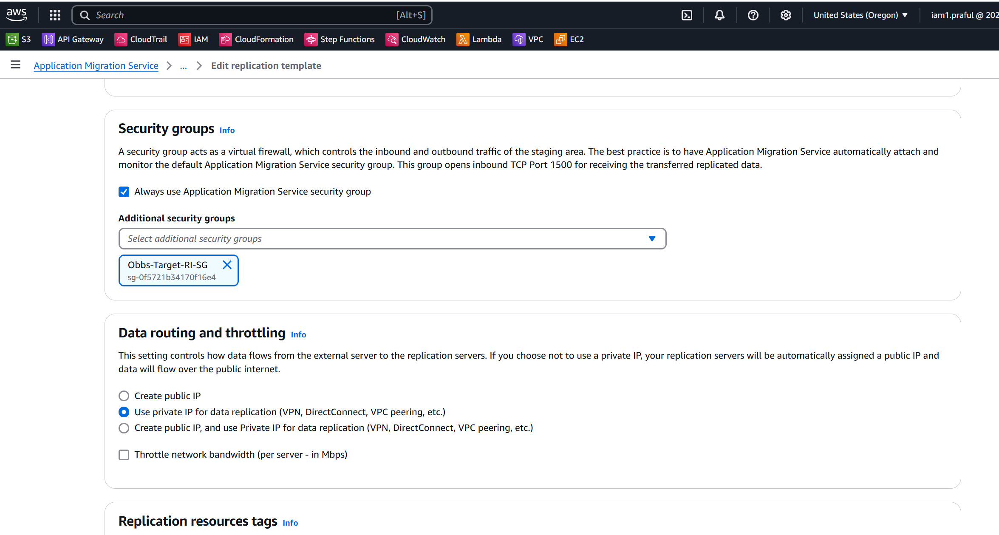
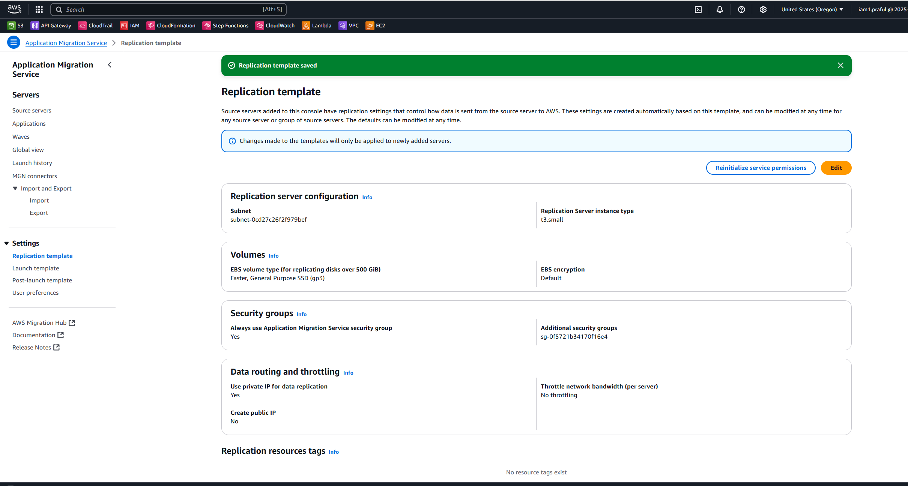
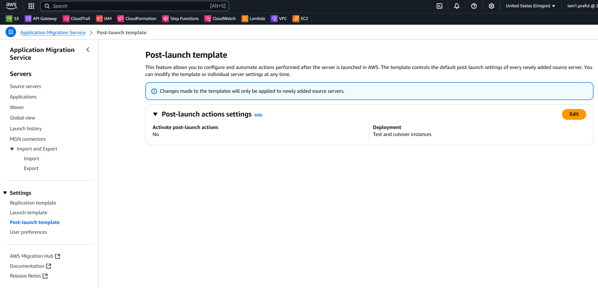
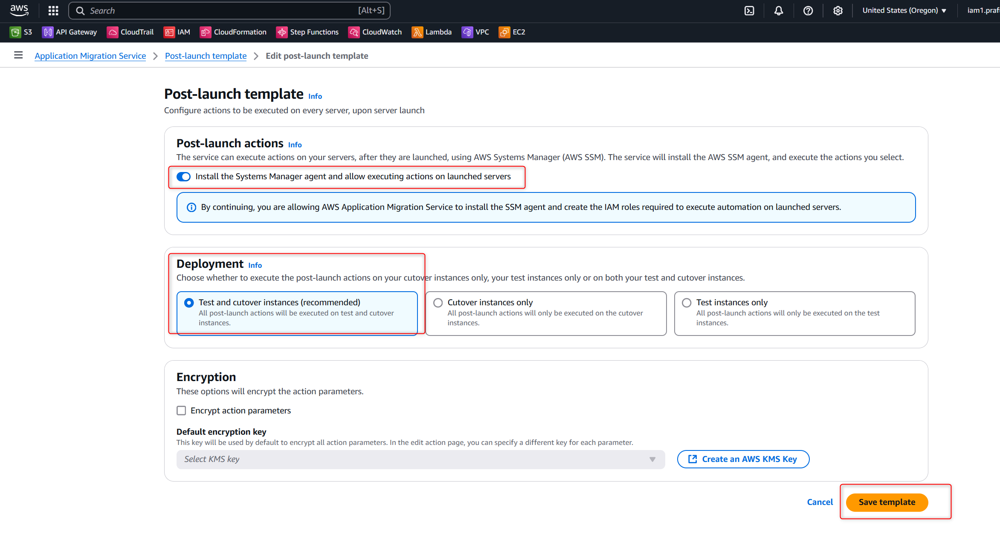
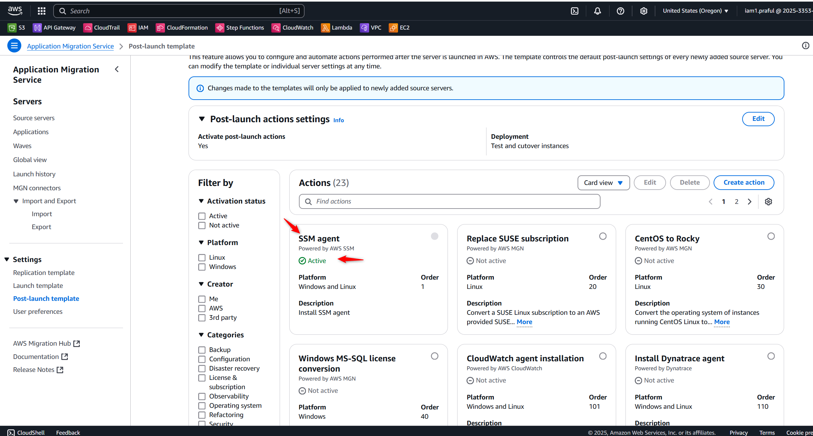

---

### **# AWS Application Migration Service - Initial Setup & Replication Template Creation** 🏗️

## **1️⃣ Initial Setup of AWS Application Migration Service**
1. **Login to AWS Console** 🔐  
   - Navigate to **AWS MGN** (Application Migration Service) → [AWS MGN Console](https://console.aws.amazon.com/mgn)  

2. **Enable AWS MGN in your AWS Account** ✅  
   - Click on **"Get started"**  
   - Choose the AWS Region where migration will take place 🌎  

3. **Create a Replication Settings Template** 🛠️  
   - Go to **"Replication settings"** → Click **"Create replication settings template"**  

---

## **2️⃣ Create Replication Template**
### **📌 Step 1: Define Network Connectivity**
- Choose **Replication Servers' Network Configuration**  
  - **Use private IP for data replication** (VPN, DirectConnect, or VPC Peering recommended) 🔒  
  - (Optional) **Create public IP if needed** 🌐  

  

### **📌 Step 2: Set Replication Server Instance Type**
- Select the **EC2 instance type** for replication servers  
- Choose **IAM Role** (Ensure it has the required permissions)  

### **📌 Step 3: Configure Data Routing & Throttling**
- **Enable Data Routing**  
  - Use private IP for secure transfer 🛡️  
  - (Optional) Create public IP if needed 🌍  
- **Set Network Bandwidth Throttling** (to avoid congestion) 🚦  

### **📌 Step 4: Create & Apply the Replication Template**
- Review all settings 🧐  
- Click **"Create template"** 📝  
- Apply this template to all source servers that require replication 🔄  

---

## Post- launch template

## **3️⃣ Next Steps**
🚀 **Start Replication & Perform Test Migration**  
- Add source servers to **AWS MGN**  
- Monitor replication progress via **AWS MGN Console** 📊  
- Run a **Test Migration** before cutover 🔄  
- Execute the **Final Cutover** to switch production traffic ✅  

---

Now you're all set for a smooth **AWS migration** using **AWS MGN**! 🚀💡  

Let me know if you need further details or modifications! 😊