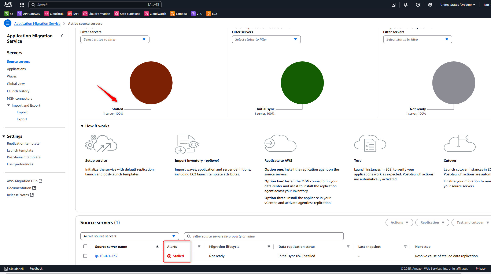
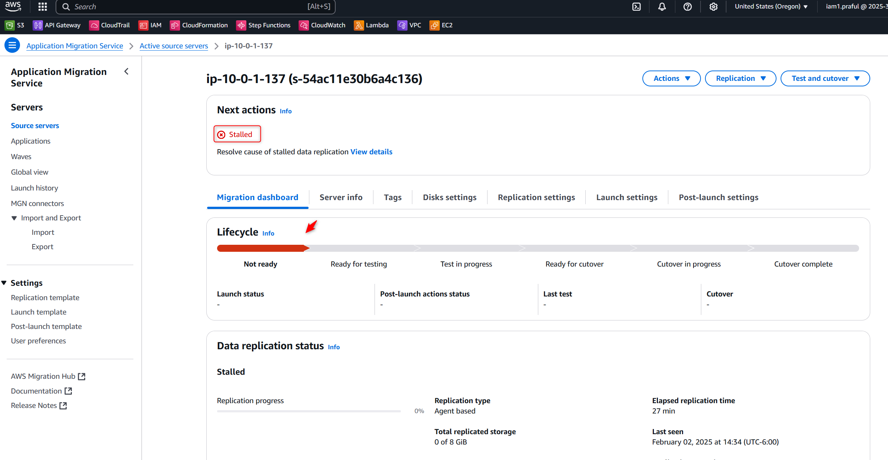
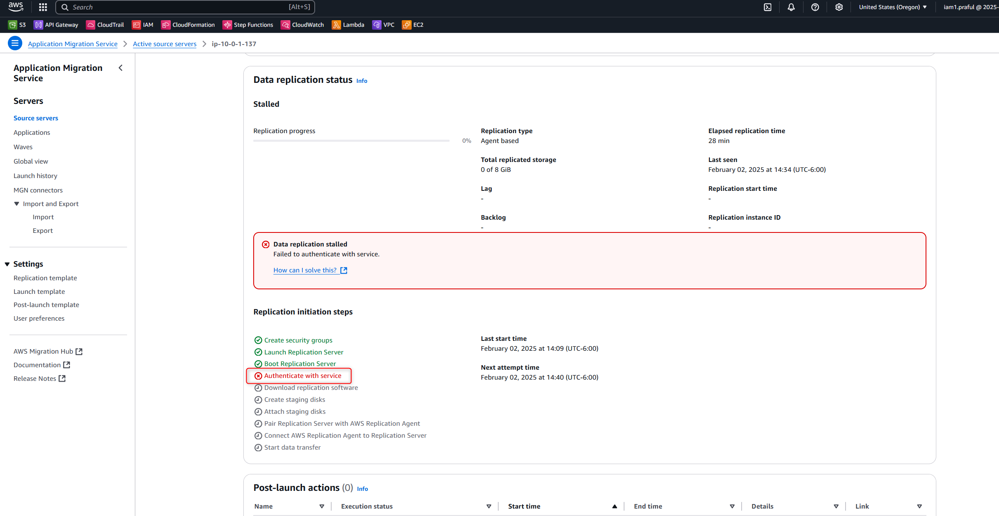

### **🛑 Stalled Status in AWS MGN - What It Means & How to Fix It?**

In **AWS Application Migration Service (AWS MGN)**, a **"Stalled"** status indicates that the replication process has stopped or is **not progressing** due to an issue. This status can appear under **Source Servers** when checking the replication status.








---

## **🚨 Why Does "Stalled" Status Occur?**
The **stalled status** means that the AWS MGN **replication agent is not able to transmit data** from the source server to the replication server. This can happen due to multiple reasons:

### **1️⃣ Network Issues 🚧**
- **VPN / Direct Connect / Firewall blocking traffic** 🔒  
- **Network latency or instability** affecting replication 📶  
- **Incorrect routing in AWS VPC or on-premises network** 🌐  

### **2️⃣ Replication Agent Issues 🖥️**
- The **AWS MGN agent is not running** or has stopped 🔄  
- **Agent installation failed or is outdated** ❌  
- **Agent cannot communicate with AWS MGN service** (due to missing permissions or connectivity issues) 🚫  

### **3️⃣ IAM Permissions Issues 🔑**
- The **IAM role for replication is misconfigured** 🚨  
- AWS MGN **cannot access the replication servers** due to a missing policy  

### **4️⃣ Storage or Disk Space Issues 💾**
- **Insufficient disk space on the source server** ⏳  
- **EBS volume issues on the AWS replication server** 🛑  

### **5️⃣ Data Transfer Throttling 🚦**
- **Bandwidth throttling is too strict**, slowing down replication ⚡  
- **Replication settings limit network bandwidth usage**  

---

## **🛠️ How to Fix "Stalled" Status?**
### **✅ Step 1: Check Network Connectivity**
- Verify that the **source server can reach AWS** (check **VPN, DirectConnect, or internet firewall rules**).  
- **Run a connectivity test** using:  
  ```bash
  curl -v https://aws-application-migration-service-agent.s3.amazonaws.com/
  ```
  If it fails, update **firewall rules** to allow traffic.

### **✅ Step 2: Restart the AWS MGN Agent**
- **Linux:**
  ```bash
  sudo systemctl restart mgn-agent
  sudo systemctl status mgn-agent
  ```
- **Windows:**
  - Open **Services** → Find **AWS Replication Agent** → Restart  

### **✅ Step 3: Check IAM Permissions**
- Ensure the **IAM role** attached to AWS MGN has the required permissions:  
  - `AWSApplicationMigrationReplicationServerPolicy`  
  - `AWSApplicationMigrationFullAccess`  
- If the IAM role is missing, update and attach the correct policies.

### **✅ Step 4: Free Up Disk Space**
- Run:
  ```bash
  df -h
  ```
  If the disk is full, remove **unnecessary files**.

### **✅ Step 5: Adjust Replication Settings**
- **Increase bandwidth throttling** limit  
- **Ensure private IP is used for replication** (VPN, Direct Connect)  
- Restart replication from AWS MGN Console  

### **✅ Step 6: Restart Data Replication**
1. **Go to AWS MGN Console** → **Source Servers**  
2. Select the affected server  
3. Click **"Start Data Replication"** 🔄  

---

## **📌 Conclusion**
🚨 **"Stalled" means the replication process is blocked.**  
✅ **Fix it by troubleshooting network, agent, IAM, storage, and throttling settings.**  
📊 **Monitor replication progress in AWS MGN Console after fixing.**  

### **✅ How to Check Replication Status in AWS Application Migration Service (AWS MGN)?**
After running:
```bash
wget -O ./aws-replication-installer-init.py https://aws-application-migration-service-us-west-2.s3.amazonaws.com/latest/linux/aws-replication-installer-init.py
sudo python3 aws-replication-installer-init.py
```
You need to **verify if the replication is working properly**.

---

## **🔍 Method 1: Check Replication Status in AWS Console**
1. **Login to AWS Console** 🔐  
2. Navigate to **AWS MGN (Application Migration Service)** → [AWS MGN Console](https://console.aws.amazon.com/mgn/)  
3. Click on **"Source Servers"**  
4. Locate your server and check the **Replication Status**:  
   - **Healthy 🟢** → Replication is active  
   - **Stalled 🔴** → Issues with replication  
   - **Pending 🟡** → Initial sync is in progress  
   - **Disconnected ❌** → The agent is not communicating with AWS  

---

## **🔎 Method 2: Check Replication Logs & Agent Status (Linux)**
### **📌 Step 1: Check AWS MGN Agent Service**
Run:
```bash
sudo systemctl status mgn-agent
```
✅ **If the service is running**, you should see:
```
● mgn-agent.service - AWS Replication Agent
   Loaded: loaded (/etc/systemd/system/mgn-agent.service; enabled; vendor preset: enabled)
   Active: active (running) since ...
```
❌ **If it is not running**, restart it:
```bash
sudo systemctl restart mgn-agent
```

### **📌 Step 2: Check Replication Logs**
Check logs in:
```bash
sudo tail -f /var/log/mgn-agent.log
```
Look for:
- **"Replication started successfully"** ✅ (Good)
- **"Connection error" / "Stalled"** ❌ (Bad)

---

## **📡 Method 3: AWS CLI to Check Replication Status**
If you prefer **AWS CLI**, use:
```bash
aws mgn describe-source-servers --region <your-region>
```
This will return JSON output with **replication status**:
```json
{
    "items": [
        {
            "sourceServerID": "s-xxxxxxxx",
            "replicationStatus": "ACTIVE",
            "lastSeenTime": "2024-02-02T12:34:56Z"
        }
    ]
}
```
📌 **Possible Replication Status:**
- `"ACTIVE"` → 🟢 **Replication is working**
- `"STALLED"` → 🔴 **Issue with replication**
- `"DISCONNECTED"` → ❌ **Server is not reporting to AWS**

---

## **🔄 What to Do If Replication is Stalled?**
1. **Restart AWS MGN Agent**:
   ```bash
   sudo systemctl restart mgn-agent
   ```
2. **Verify Network Connectivity**:
   ```bash
   curl -v https://aws-application-migration-service-agent.s3.amazonaws.com/
   ```
   - If blocked, check **firewall rules** or **VPN settings**.
3. **Ensure IAM Role has Proper Permissions**:
   ```bash
   aws sts get-caller-identity
   ```
   - Attach `AWSApplicationMigrationFullAccess` policy if missing.
4. **Restart Replication from AWS Console**:
   - Go to **AWS MGN** → **Source Servers** → **Restart Replication**.

---

## **🎯 Summary**
| ✅ **Check Method** | 🔍 **Command/Steps** |
|----------------|----------------------------------|
| **AWS Console** | AWS MGN → Source Servers → Check Status |
| **Linux Service** | `sudo systemctl status mgn-agent` |
| **Logs** | `sudo tail -f /var/log/mgn-agent.log` |
| **AWS CLI** | `aws mgn describe-source-servers --region <region>` |

📌 If **replication is stalled**, restart the agent, check logs, and ensure proper IAM & network settings.
